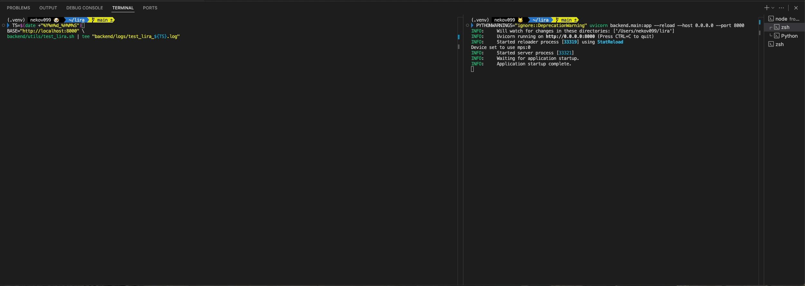

# LIRA : Emotion + Memory RAG system 

  
프론트/디버깅 화면에서 실제 입력·감정 분석 결과 확인 장면    
(짧게 보이는 미리보기 이미지입니다. 영상을 보시는 것을 권장드립니다.)    
→ [유튜브 영상으로 보기](https://youtu.be/dbauzGSeEWo)  

   
기능 테스트 주요 시나리오 실행 장면 (14/14 통과)    
(짧게 보이는 미리보기 이미지입니다. 영상을 보시는 것을 권장드립니다.)    
→ [유튜브 영상으로 보기](https://youtu.be/M5x8b6GtEAc) / LLM모델: Solar-pro2 + LIRA RAG    
→ [유튜브 영상으로 보기](https://youtu.be/LCVgO9BjCVI) / LLM모델: Gpt-4o + LIRA RAG  

> **LIRA**는 Emotion × Memory 기반의 **RAG 시스템**입니다.  
> - LIRA는 LLM이 단순히 응답을 생성하는 데 그치지 않고, **사용자의 <ins>감정과 대화를 기억·회상**</ins>할 수 있도록 설계되었습니다.  
> - 이를 통해, 기존 LLM의 <ins>"**기억 소멸**"</ins>과 <ins>"**환각 응답**"</ins> 문제를 해결하고, <ins>"**감정에 공감하는 안정된 대화 경험**"</ins>을 제공합니다.

> **TL;DR (요약정리)**    
> - 감정 분석(GoEmotions) + LTM(Mongo/Weaviate) + STM(Redis) 구조  
> - 핵심 기능: 기억 저장/회상, 세션 격리, 환각 방지,  
    TTL(유효시간, *Time To Live*) 만료 시 세션 초기화 처리 -> 프롬프트 과포화 방지
> - 기능 테스트 14/14 통과 -> 안정성 검증 완료  
> - Tech Stack: Python(FastAPI), React, Weaviate, MongoDB, Redis

> 추가문서
> - [포트폴리오 (PDF)](./[PORTFOLIO]LIRA.pdf)  
> - [기술 명세서](./[TECHNICAL]LIRA기술명세서.md)

## 주요 특징

- **감정 기반 메모리 저장**  
  입력 감정을 분석(GoEmotions 기반, 다중 라벨 + 감정 점수)하여  
  강도가 기준 이상(>=0.6) 혹은 *“기억해”* 단어가 확인되는 경우  
  장기 기억(LTM: MongoDB + Weaviate)에 기록

- **다층 회상 구조**  
  의미 기반 검색(Weaviate) + 사실/감정 회상(MongoDB) + 현재대화(Redis)를 통합하여  
  최신·관련성 높은 맥락 제공

- **세션 격리**  
  `user_id + session_id` 단위로 모든 저장/회상 수행  
  -> 사용자 간 데이터 혼입 방지

- **환각 방지**  
  근거 없는 질문에는 *“모르겠다 / 기억 없음”*으로 응답하도록 가드레일 적용


## Tech Stack
- **Backend**: Python(FastAPI, Weaviate, MongoDB, Redis)
- **Frontend**: React(Vite, Zustand, Three.js)

## 타임스탬프 정책
- 저장 및 표시: **UTC 기준**으로 통일  
  -> 시간대를 고정함으로써, 환경(한국/해외/서버)에 상관없이 항상 동일하게 기록·재현 가능

## Debug 모드(개발자용 확인)
- **환경 변수 설정**
  - `LIRA_DEBUG=1` -> 프롬프트/키워드/대화 로그 출력 (개발·테스트용)
  - `LIRA_DEBUG=0` -> 운영 기본값 (로그 비출력)
- **적용 위치**
  - `backend/.env` 파일에 설정
  
- DEBUG 예시 로그

```
[사용자정보 확인] user_id=test_user session_id=session_001
[STM] 세션 불러오기: session_001

[1. 사용자 입력 및 감정 요약]
입력: "그럼 내가 좋아하는건 뭔지 기억나?"
감정: neutral=0.661, curiosity=0.342

[2. 회상 단계]
- Case2 사실회상: "아니다 내가 좋아하는건 카라멜 마끼아또야..."
- Case3 감정회상: "내가 좋아하는건 아이스 아메리카노야..."
-> 회상 결과 2개 (중복제거·최신순)

[3. STM 업데이트]
회상된 기억 2개 STM 버퍼 적재 -> session_001 업데이트 완료

[4. LTM 저장]
조건 충족(감정점수 >= 0.6) -> LTM 저장 허용
Mongo/Weaviate에 기록 완료

[5. 최종 출력] [후두엽+언어피질]
회상된 기억:
- (15:42:24) 카라멜 마끼아또
- (15:42:18) 아이스 아메리카노

사용자 입력: "그럼 내가 좋아하는건 뭔지 기억나?"
리라 응답: "네, 사용자님이 좋아하는 건 카라멜 마끼아또라고 기억하고 있어요 ☕️"
```

## 실행 방법

### 1. 실행 환경
- **필수**: Python 3.10 이상, Node.js 18+
- Docker / Docker Compose
- (권장) macOS/Linux 환경, 최소 8GB RAM  
- 본 문서는 macOS/Linux 개발 환경 기준으로 작성되었습니다. (Windows 환경은 별도 검증되지 않았으므로, 사용 시 참고 부탁드립니다.)

### 2. 소스코드 클론
```
git clone https://github.com/hwp2024dev/lira-public.git
cd lira-public
```

### 3. DB 컨테이너 세팅 (Docker 기반)
```
docker compose up -d --build
```

### 4. 환경 변수 파일 준비
```
cd backend
cp .env.example .env   # .env.example -> .env 복사 후, 사용할 LLM API 키 및 DB URL 입력
# backend/.env에 필요한 키: OPENAI_API_KEY(gpt4o 모델) 또는 UPSTAGE_API_KEY(solar-pro2 모델), COHERE_API_KEY, MONGO_URL, WEAVIATE_URL, REDIS_URL, LIRA_DEBUG
```

### 5. 백엔드 실행

```
# 루트 경로(lira-public)에서 실행 권장
cd ..

# 백엔드용 가상환경 최초 1회 생성
python3 -m venv backend/.venv       

# 가상환경 활성화
# (Mac/Linux)
source ~/lira-public/backend/.venv/bin/activate

# 패키지 설치
pip install -r backend/requirements.txt  

# 서버 실행 (pydantic v2 관련 DeprecationWarning 무시)
# 주의:서버 실행은 INFO: Application startup complete. 문구가 확인 될때까지 꼭 기다려 주셔야 합니다!!
# 첫 실행시, '약 1분'가량 기다려주시기 바랍니다.

PYTHONWARNINGS="ignore::DeprecationWarning" \
uvicorn backend.main:app --reload --host 0.0.0.0 --port 8000
```


### 6. 작동 테스트  
※ VScode메뉴창 -> Terminal -> Split Terminal선택후, 분할된 터미널에서 실행합니다    
>예시: 백엔드 테스트용 LIRA 응답 생성  
```
# 분할된 터미널에서 가상환경 설정
source ~/lira-public/backend/.venv/bin/activate

# 테스트용 curl문
curl -X POST "http://localhost:8000/api/lira/generate" \
  -H "Content-Type: application/json" \
  -d '{"user_id":"test_user","session_id":"s1","text":"안녕"}'
```

### 7. 프론트엔드 실행  
※ 분할된 터미널에서 실행 후, 아래의 커맨드를 입력합니다. Local: http://127.0.0.1:5173/ 주소를 cmd + 클릭  
```
cd frontend
npm install
npm run dev   # http://localhost:5173 접속
```  

### 8. 기능 테스트  
※ 분할된 터미널에서 ctrl+c를 눌러 프론트 종료후, 루트 경로 이동
```
cd ..
``` 
> 이후, 자동화 스크립트(`backend/utils/test_lira.sh`)로 핵심 기능을 검증합니다.  
```
# 최초 1회 실행 권한 부여
chmod +x backend/utils/test_lira.sh

# 테스트 실행 (로그는 timestamp 붙여 저장)
TS=$(date +"%Y%m%d_%H%M%S")
BASE="http://localhost:8000" \
backend/utils/test_lira.sh | tee "backend/logs/test_lira_${TS}.log"
```

### 9. 테스트 시나리오 요약  
| 번호 | 시나리오            | 목적/검증 포인트 |
|------|---------------------|------------------|
| 1~3  | 이름 저장/회상      | 사용자 이름 저장 및 정확한 회상 (세션 격리 포함) |
| 4~5  | 감정 문장 저장/회상 | 감정이 담긴 발화가 올바르게 저장·회상되는지 확인 |
| 6~7  | 일정 정보 저장/회상 | 날짜·장소 정보가 정확히 저장·회상되는지 검증 |
| 8~9  | 임시 메모 (STM)     | Redis STM에 임시 메모 저장 및 즉시 회상 가능 여부 확인 |
| 10~11| TTL 만료            | TTL 단축(24h->10s) 후 만료 시 회상 불가 확인 |
| 12   | 장기 기억 초기화    | MongoDB/Weaviate 데이터 삭제 정상 동작 검증 |
| 13   | TTL 만료 후 회상 실패 | TTL 만료 및 초기화 후 회상 실패 여부 확인 |
| 14   | 환각 방지           | 근거 없는 질문에 “기억 없음/모르겠다”로 안전 응답 반환 |

### 10. 기능 테스트 결과  
>모든 시나리오 14/14 통과  
```
#테스트 결과저장 폴더("backend/logs/")
```

### 11. DB 리셋
> (주의!) 실제 업무/개인 환경인지 확인 후, 사용하세요.
#### 테스트 중 DB를 초기화하고 싶을 때 사용할 수 있는 명령어들:
```
#Redis(STM)만 전체 초기화
docker exec -it redis redis-cli FLUSHALL

# MongoDB/Weaviate(LTM)만 초기화
python3 backend/utils/reset_memory.py -y
```  

### 12. Troubleshooting

> (주의!) 실제 업무/개인 환경인지 확인 후, 사용하세요.  
#### 포트 충돌 (대표 포트: 8000/5173/6379/27017)
- 어떤 프로세스가 점유 중인지 확인  
  - macOS/Linux: `lsof -i :8000`  -> PID 확인 후 `kill -9 <PID>`  
  - (프론트) 5173, (Redis) 6379, (Mongo) 27017도 동일 방법
- 급하게 포트만 바꾸기  
  - 백엔드: `uvicorn backend.main:app --reload --host 0.0.0.0 --port 8001`  
  - 프론트: `npm run dev -- --port 5174`

#### Docker 관련
- 현재 상태 보기: `docker compose ps`  
- 안전 종료: `docker compose down`  
- 로그 확인: `docker compose logs -f backend` (서비스명은 `docker compose ps`로 확인)  
- **볼륨까지 초기화(데이터 삭제 주의)**: `docker compose down -v`  
- Compose 외부에서 뜬 낙오 컨테이너만 강제 종료할 때: `docker rm -f <컨테이너ID>`

#### npm install 오류
- 권장: Node.js 18+  
- 빠른 초기화: `rm -rf node_modules && npm ci` (lockfile이 있을 때 재현성 ↑)  
- 여전히 실패 시: `npm cache clean --force && npm ci`
  
## License

이 프로젝트는 **MIT License (Modified for Portfolio Use)** 하에 배포됩니다.  
자세한 내용은 [LICENSE](./LICENSE.md) 파일을 참고하세요.

- 본 저장소는 **포트폴리오 제출/평가(면접) 용도**로 공개되었습니다.
- 코드/문서의 **재배포·상업적 이용은 허용되지 않으며**, 별도 사전 동의가 필요합니다.
- 참고/인용 시 **출처 표기 권장**: Hyunwoo Park · https://github.com/hwp2024dev/lira-public

※ `docs/` 폴더 내 이미지·GIF 등 에셋은 별도 저작권이 적용될 수 있습니다.  
사용 시 출처를 명시하고, 권리 범위를 반드시 확인해 주세요.

## Contact
기타 문의사항도 가능합니다.  
email: **hwp2024dev@gmail.com**
