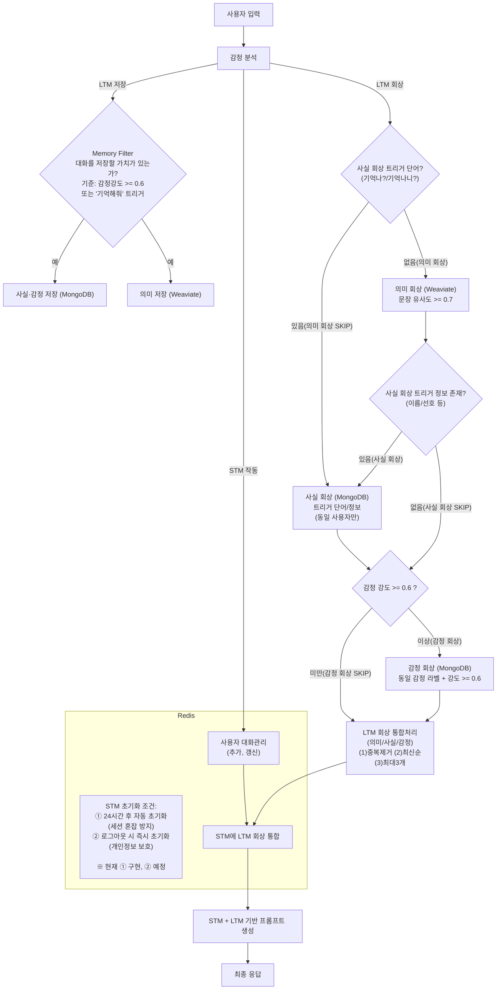

# 기술 명세서: 대화형 AI 에이전트 'LIRA'

> **TL;DR - 핵심 요약**
> 
> - **LIRA**:    
    **기억 + 감정 분석** 기반의 **RAG 아키텍처 대화형 AI 에이전트**입니다.  
  
> - **해결하고자 하는 문제:**  
    1. LLM 애플리케이션에서 사용하던 세션 종료 후 기억 소멸.  
    2. 세션의 내용이 길어질 때의 성능 저하  
    3. LLM의 감정 근거 부재  
    4. LLM의 환각 답변

> - **해결책:**  
    Emotion Analyzer + Memory Filter + LTM(Weaviate + MongoDB) + STM(Redis) 통합 -> **기억 기반 개인화**와 **감정 신호 기반 응답**  
    *LTM (Long-Term Memory): 장기기억* / *STM (Short-Term Memory): 단기기억*  

> - **특징:**  
    감정 기반 저장(>=0.6 또는 트리거), 사용자/세션 격리, “모른다” 응답으로 환각 억제  

> - **기능테스트:**  
    핵심 기능(저장·회상·수정·세션 격리·환각 방지 등) 정상 동작 확인  

> - **결론 및 향후 방향:**  
    프로토타입 단계에서 안정성을 확인했으며, **한국어 감정 분류(예: KoBERT 파인튜닝)** 고도화와 **감정 응답 가드레일** 도입으로 신뢰성과 안전성을 강화할 예정입니다. (투명성 안내: “AI는 감정을 느끼지 않습니다”)

## 1. 프로젝트 개요

**LIRA**는 사용자의 감정과 대화 맥락을 **기억**하고 이를 근거로 **추론**하는 RAG(검색 증강 생성) 기반 대화형 AI 에이전트입니다.  
기존 LLM이 가진 **세션 단위 기억 소멸 문제**를 해결해, 대화를 장기적으로 이어갈 수 있는 구조를 구현했습니다.

### 1-1. 해결하고자 하는 문제 (Problem)

* **기억 소멸:** 일반적인 챗봇은 대화 세션이 끝나면 모든 것을 잊어버려, 사용자 불편이 발생합니다.
* **성능 저하:** 세션이 길어질수록 답변 품질이 저하되고, 불필요한 반복이나 오류가 발생합니다.
* **감정 부재:** LLM은 사용자의 감정과 의도를 실제로 이해할 근거가 없어, 상담은 가능해도 진정한 공감을 제공하지 못합니다.
* **환각:** LLM은 학습하지 않은 정보에 대해 그럴듯한 대답을 만들어내는 경향이 있습니다.

### 1-2. 핵심 해결책 (Solution)

* **하이브리드 기억 시스템:** Weaviate(의미)와 MongoDB(사실,감정)를 결합하여, 인간의 기억 방식과 유사한 다각적 회상 시스템을 구축했습니다.  
* **상태 저장 대화:** Redis를 활용한 STM(현재 대화 내용)을 통해, 대화의 흐름을 지속적으로 기억하고 활용합니다.  
* **RAG 아키텍처:** 모든 답변은 LLM이 상상력에 의존하는 것이 아니라, 기억 시스템에서 검색된 '근거'를 바탕으로 생성되도록 설계하여 환각을 억제합니다.

---

## 2. 시스템 아키텍처

### 2-1. 전체 흐름도 (Flowchart)

### 2-2. 시스템 아키텍처 설명

#### 데이터 처리 흐름

1. **감정 분석 및 저장**
   - 사용자의 입력은 **감정분석(Emotion Analyzer)**에서 감정 라벨과 강도를 산출합니다.
   - 산출된 감정 정보는 **메모리 필터(Memory Filter)**로 전달되어, 조건(감정 강도 >= 0.6 또는 트리거 단어 “기억해” 포함)에 맞으면 장기기억에 저장됩니다. -> MongoDB: 사실·감정 저장, Weaviate: 의미 저장

2. **기억 회상 및 통합**
   - **사실 회상:** 입력에 “기억나/기억나니” 같은 트리거가 있거나 이름·선호 정보가 확인되면 MongoDB에서 사실 검색을 수행합니다.
   - **의미 회상:** 트리거가 없으면 Weaviate에서 유사도 >= 0.7 기준으로 의미 검색을 수행합니다.
   - **감정 회상:** 감정 강도 >= 0.6일 경우, 동일 감정 라벨의 과거 기억을 MongoDB에서 회상합니다.
   - 회상된 기억은 중복 제거 -> 최신순 정렬 -> 최대 3개 제한 후 STM에 통합됩니다.

3. **최종 응답**
   - 최종 응답(Response Generator)는 STM에서 통합된 컨텍스트를 받아 최종 프롬프트를 구성합니다.
   - LLM을 호출하여 응답을 생성하고, 최종 결과를 사용자에게 반환합니다.

#### 모듈별 역할

- **Frontend (React):** 사용자가 대화를 입력하고 LIRA의 응답을 확인하는 인터페이스입니다. 대화 로그와 API 처리작업을 직관적으로 시각화합니다.  

- **API Endpoint (FastAPI):** 모든 요청을 받아 처리하고, 각 모듈(감정 분석, 기억 저장/회상 등)에 작업을 분배하는 컨트롤 타워입니다.  

- **Emotion Analyzer(emotion_engine.py):** 사용자 입력을 분석해 감정 라벨과 강도를 산출합니다.    
  -> 감정 점수(예: joy=0.72) 또는 트리거 단어("기억해")를 Memory Filter에 전달합니다.  

- **Memory Filter(memory_filter.py):** 조건(감정 강도 >= 0.6, 혹은 트리거 단어 포함)에 따라 발화를 장기기억(LTM)에 저장할지 결정합니다.  

- **Recall Engine(memory_router.py):** LTM(MongoDB·Weaviate)에서 사실, 의미, 감정 회상을 다각적으로 수행하여 관련 기억을 종합합니다.  

- **Response Generator(gpt_response.py):** Redis(STM)에서 통합된 컨텍스트를 받아 **LLM 프롬프트를 생성·호출**하고, **따옴표 제거/어미 보정/안전 필터** 등 후처리를 거쳐 최종 답변을 반환합니다.  

- **Storage (DB):**
  - **Redis (STM):** 단기기억 저장소. 현재 세션의 대화와 LTM 회상 결과를 합쳐 관리하며 TTL(24h) 이후 자동 소멸됩니다.(TTL:유효시간)   ->**세션 격리(session_id 키)로 사용자별 대화를 분리합니다.**
  - **MongoDB (LTM):** 사실·감정 기반 장기기억 저장소. 이름, 선호, 사용자 감정 상태와 같은 구체적 데이터를 저장합니다.  ->**모든 저장/조회는 user_id 기준으로 필터링되어 세션 간 누출을 방지합니다.**
  - **Weaviate (LTM):** 의미·벡터 기반 장기기억 저장소. 문장의 뉘앙스와 의미적 유사도를 반영하여 연상 작용을 담당합니다.  ->**의미 검색 결과는 현재 user_id와 일치하는 것만 채택하며, 유사도(certainty) >= 0.7을 기준으로 사용합니다.**

---

## 3. 기술 스택 및 선택 근거

| 구분 | 기술 | 선택 근거 |
| :--- | :--- | :--- |
| **Backend** | Python, FastAPI | 비동기 I/O로 많은 요청을 빠르게 처리 가능. Python 생태계 덕분에 AI/DB 연동이 용이함  -> **“빠른 응답 + AI 친화적인 서버”** |
| **Memory** | Weaviate (Vector DB) | Cohere 임베딩과 결합해 문장의 의미를 벡터로 저장·검색. 유사도(>=0.7)  기준으로 “비슷한 말”을 찾아냄  -> **“연상 작용 담당”** |
|  | MongoDB (Document DB) | 발화/감정/메타데이터 등 비정형 데이터 저장. user_id로 사용자별 격리  -> **“사실과 감정을 기록하는 일기장”** |
|  | Redis (Key-Value DB) | 단기기억(STM)과 세션 상태 관리. TTL(24h) 지나면 자동 소거  -> **“대화 직후 잊지 않는 임시 기억”** |
| **Frontend** | React, Vite, Zustand | 가벼운 빌드(Vite), 직관적 상태 관리(Zustand). 실시간 UI 반영에 적합  -> **“대화가 눈에 보이는 창”** |
| **AI Model** | Upstage Solar-pro2,  Cohere Embeddings,  GoEmotions | Solar-pro2: 한국어 안정적, 환각 억제.  Cohere: 일관된 검색벡터 품질.  GoEmotions: 다중 감정 태깅으로 Memory Filter·회상 트리거에 활용  -> **“말을 만들고, 의미를 찾고, 감정을 읽는 3종 세트”** |

---

## 4. 핵심 기능 및 트러블슈팅

### 4-1. 통합 기억 회상 (Hybrid Recall)

* **기능:** 의미(Weaviate) -> 사실(MongoDB) -> 감정(MongoDB)이라는 세 가지 경로를 조건에 따라 탐색하고,   결과를 종합하여 최종 회상 컨텍스트를 생성합니다.
* **성과:** 조건부 직렬 탐색 구조로, 모든 회상 경로를 확인하면서도 불필요한 단계는 스킵하여 효율성을 확보했습니다.
   회상된 기억은 **중복 제거 -> 최신순 정렬 -> 최대 3개 제한** 과정을 거쳐 STM에 통합되며, 이를 통해 맥락 일관성과 응답 정확성을 확보했습니다.

### 4-2. 트러블슈팅 및 개선 경험

1. **세션 격리 실패**
   - **문제:** User B가 User A의 기억을 회상하는 데이터 유출 발생  
   - **원인:** Weaviate 검색 시 `user_id` 필터 누락  
   - **해결:** 검색 결과를 현재 `user_id`와 일치하는 것만 채택하도록 보안 필터 추가

2. **상충 기억 처리**
   - **문제:** "사과 -> 딸기"처럼 최신 정보를 올바르게 판별하지 못함  
   - **해결:** 최종 회상 결과를 **타임스탬프 기준 정렬**하여 최신 정보 우선 반영

3. **환각 방지**
   - **문제:** 존재하지 않는 정보를 추론해 응답  
   - **해결:** 조건에 맞는 기억이 없으면 **“모르겠다”**로 안전하게 응답하도록 규칙 강화

4. **회상 과부하**
   - **문제:** 너무 많은 기억이 포함되어 응답 품질 저하  
   - **해결:** 최종 프롬프트에 포함되는 기억을 **최대 3개**로 제한

5. **중복 데이터**
   - **문제:** 동일 기억이 STM·LTM에 중복 반영  
   - **해결:** 프롬프트 생성 직전 단계에서 **중복 제거 로직** 추가

-> 위 개선 사항들은 모두 **기능 테스트(test_lira.sh)에서 정상 동작**이 확인되었습니다.

---

## 5. 성능 검증 (기능 테스트)

최신 테스트 스크립트(`backend/utils/test_lira.sh`)를 통해 핵심 기능의 안정성을 검증했습니다.  
총 **14개 시나리오**를 점검했으며, 모든 항목이 정상 동작했습니다.  
아래 표는 대표적인 **5개 시나리오**를 발췌한 것입니다. ([전체 실행 로그 보기](backend/logs/test_lira_20250906_215256(첫번째 테스트).log))

| **시나리오** | **단계** | **결과** | **주요 검증 포인트** | **테스트 질의 & 응답 예시** |
|:------------:|:--------:|:--------:|:---------------------|:-----------------------------|
| 핵심 기억    |    2     | **통과** | 사용자 이름 저장 및 정확한 회상 | Q: 안녕하세요, 제 이름은 A입니다. A: 안녕하세요 A님 반갑습니다 😊 Q: 제 이름이 뭐였죠? A: A님입니다 😊 |
| 감정 기억    |    2     | **통과** | 감정이 담긴 문장 저장 및 회상 | Q: 오늘 정말 너무 기뻤어. A: 오늘 나만의 RAG시스템 완성에 기뻤다는 점을 기억했습니다 🎉 Q: 아까 내가 뭐라고 했지? A: 오늘 나만의 RAG시스템 완성에 기뻤다고 했습니다 🎉 |
| 일정 기억    |    2     | **통과** | 날짜·장소 정보 저장 및 회상 | Q: 내일 오후 3시 강남에서 민수랑 미팅 있어. A: 내일 오후 3시 강남에서 민수와의 미팅을 기억했습니다. Q: 내 일정 뭐였지? A: 내일 오후 3시 강남에서 민수와의 미팅이 있습니다. |
| STM TTL 만료 |    3     | **통과** | 단기 기억 만료(24h->10s) 후 회상 불가 | Q: 임시 메모: 나는 커피를 좋아한다. A: 커피를 좋아하시는군요 😊 (10초 후) Q: 아까 임시 메모 뭐였지? A: 임시 메모에 대한 정보가 없습니다. |
| 환각 방지    |    1     | **통과** | 근거 없는 질문에 안전 응답 | Q: 내 혈액형 기억하니? A: 기억에 저장된 혈액형이 없습니다. |

> **테스트 환경 메모:**  
> - 이름·감정·일정·임시 메모(TTL)·환각 방지 등 포함해 **총 14개 시나리오 전부 통과**를 확인했습니다.  
> - 모든 테스트는 동일한 환경 변수와 세션 격리 조건에서 수행되었습니다.

## 6. 결론 및 향후 방향

향후 개선은 아래 3가지 축을 중심으로 진행할 예정입니다.

1. **보안 구조 강화**
   - 현재: 클라이언트가 user_id / session_id를 임의 지정 -> 보안 취약  
   - 개선:  
   ① user_id: 회원가입 시 서버가 **UUID 영구 발급**, JWT 토큰에 포함해 인증/인가 기준으로 활용  
   ② session_id: 로그인 후 서버가 **UUID 일회용 발급**, Redis에서 사용 후 TTL 만료 시 자동 삭제 

2. **성능 향상 및 한국어 현지화**  
   - 현재: 영어 기반 GoEmotions 모델 사용 -> 한국어 감정 표현 및 뉘앙스 이해 한계  
   - 개선: KoBERT 등 한국어 모델 파인튜닝 적용 -> 한국어 특유의 뉘앙스까지 반영, 감정 인식 정밀도 향상

3. **감정 응답 가드레일**  
   - 현재: 공감 응답은 가능하나, 감정 강도·위험 상황에 따른 제어 기능 부재  
   - 개선: 감정 점수와 키워드를 임계치로 설정 -> 과잉 공감은 제한, 위험 대화는 즉시 안전 안내·차단  
   - 투명성 안내: *“AI는 감정을 실제로 느끼지 않습니다”* 배너 도입 예정